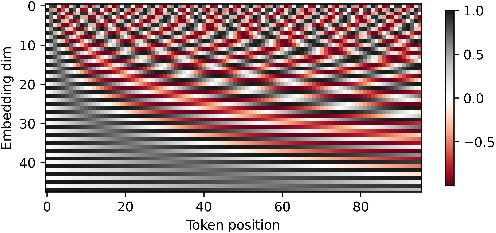
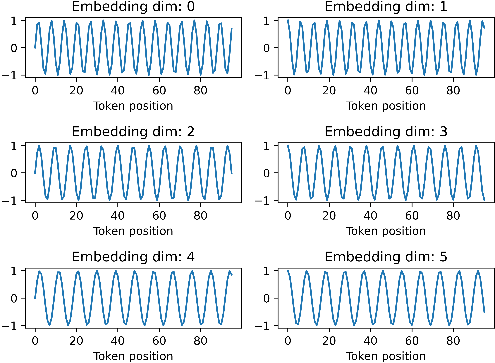

# attention-is-all-you-need
Implementation of the "Attention is All You Need" (arXiv:1706.03762) Paper

## Tokenizer
Note that the tokenizer `bpe_tokenizer_37k.json` used here was obtained by training on the training, validation and test data of the IWSLT2017 DE-EN data. This is the same data that the transformer sees. However, in this [video](https://www.youtube.com/watch?v=zduSFxRajkE), Karpathy recommends to use different data, so you might want to do that.

Also, please note that the BPE tokenizer was first trained specifying the special tokens `[UNK]`, `[CLS]`, `[SEP]`, `[PAD]` and `MASK`. Later, I modified my code such that only `[UNK]` and `[PAD]` are special tokens appearing in the vocabulary, and added `[SOS]` as a start of sentence token. To avoid having to retrain the tokenizer for about two days on a consumer-grade CPU, I modified the used vocabulary [`bpe_tokenizer_37k.json`](transformer/bpe_tokenizer_37k.json) by removing the special token `[CLS]` and usnig `[SOS]` instead. This modification happened in-place.

## Run
First build the docker container,
```
docker build -f Dockerfile -t transformers:1.0.0 .
```
### Shakespeare
To run the preprocessing for the Shakespeare dataset, run
```
docker run --shm-size 512m --rm -v $(pwd):/app --gpus all -it transformers:1.0.0 python -B /app/transformer/data.py --train_split 0.8 --dataset shakespeare
```
This saves two tensor files and one `.json` file containing the metadata. Note that for the Shakespeare dataset, a character-level tokenization is chosen, i.e. one token is one character.

Then to run the training,
```
docker run --shm-size 512m --rm -v $(pwd):/app --gpus all -it transformers:1.0.0 python -B /app/transformer/run.py --config configs/conf.json --train
```
You can also specify a W&B key by appending `--wandb__api_key ...` and change the saving path.

### OpenWebText
```
docker run --shm-size 512m --rm -v $(pwd):/app --gpus all -it transformers:1.0.0 --config configs/conf.json --train
```
By default, [`torch.compile()`](https://pytorch.org/docs/stable/generated/torch.compile.html) is used, which reduces training time.

In order to generate text from a pre-trained model, run
```
docker run --shm-size 512m --rm -v $(pwd):/app --gpus all -it transformers:1.0.0 --config configs/conf.json --loading_path <loading_path> --num_steps 0
```

In the original [Attention is All You Need](http://arxiv.org/abs/1706.03762) paper, the model is reported to have about `65`M parameters, the implemented transformer in this repo - with the options provided in `configs/conf.json` - has about `63`M params.

### W&B
If you want to log some metrics to [Weights & Biases](https://wandb.ai/), append the following to the `docker run` command:
```
--wandb__api_key <api_key>
# --wandb__api_key 2fru...
```

## Positional Encoding
For an embedding dimension of $48$ and a sequence length of $96$, the following two plots are visualizations of the positional encoding:

<div style="display: flex; justify-content: center;">
    
</div>
<br>

<div style="display: flex; justify-content: center;">
    
</div>
<br>


For the chosen BPE tokenizer, the total number of *train* tokens is `8.8`M.

## TODO
[ ] add label smoothing
[ ] add flag to specify # checkpoints, implement code for this
[ ] add github action workflows
